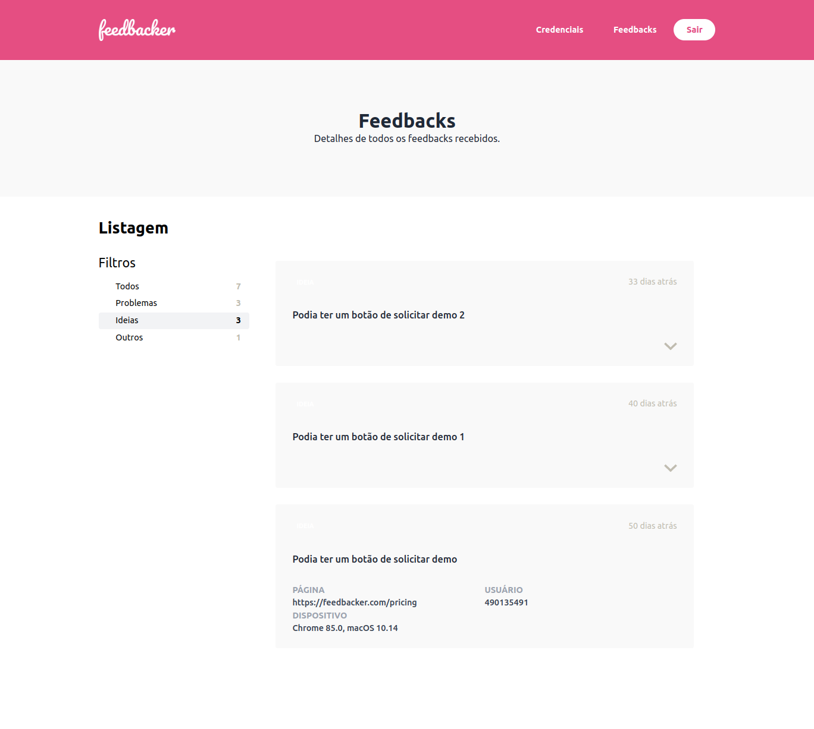
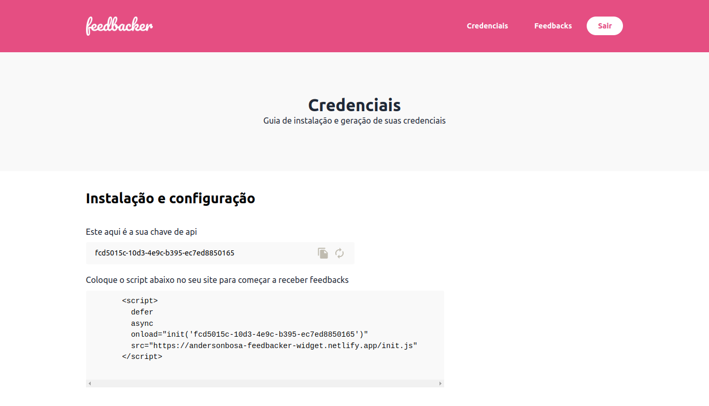

# feedbacker-app

## Credentials

- email: `user@feedbacker.com`
- password: `1234`

---

## Prints

    
Página inicial:

    

    
Página de feedbacks:

    

    
Página de credenciais:

    

---

## Getting started with Nuxt3

Check the [getting started](./docs/getting-started.md) doc.