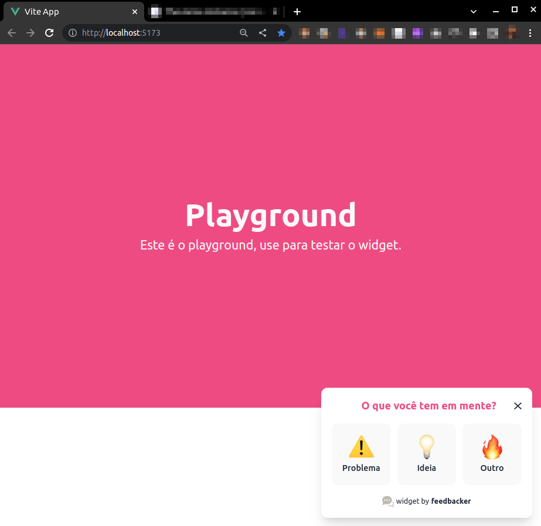

# feedbacker-widget

Brief summary of what this project is and what it does.

## About

This is a Vue.js 3 project that uses Vite.js and Typescript. The goal of this project is to provide a feedback collection tool that can be easily embedded into client's websites.

Demo:

---

## Getting Started

To download and install this project, follow these steps:

1. Clone the repository to your local machine
2. Install any necessary dependencies using the package manager of your choice
3. Run the project using the command `npm start` or `yarn start`

Futher details can be found in this [doc](./docs/getting-started.md).

---

## Future Work

List any future features, improvements, or bug fixes that are planned for the project.

---

## Contribution Guidelines

If you would like to contribute to this project, please follow these guidelines:

1. Fork the repository
2. Create a new branch for your feature or bug fix
3. Write your code and test it thoroughly
4. Submit a pull request to the main repository

---

## License

This project is licensed under the MIT license. See the [LICENSE.md](LICENSE.md) file for details.
